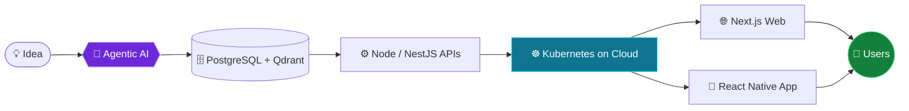

<p align="center">
  <a href="https://github.com/KamalHunzai">
    
  </a>
</p>

---

## 💻 Terminal

```console
kamal@architect:~$ whoami
kamal.hussain — builds intelligent, high-demand apps

kamal@architect:~$ cat stack.txt
agentic-ai · vector-db · postgres · kubernetes · react · react-native

kamal@architect:~$ ./deploy --target cloud --platforms web,mobile
✔ agents online   ✔ web live   ✔ mobile shipped

kamal@architect:~$ echo $STATUS
open-to-collaboration=true ▌
```

---

## 🎮 Character Sheet &nbsp;·&nbsp; Class: Architect &nbsp;·&nbsp; LVL ∞

```text
Agentic AI            ██████████████████░░  92
React / React Native  ███████████████████░  95
Cloud & Kubernetes    █████████████████░░░  88
Data Architecture     ██████████████████░░  90
Automation Wizardry   ███████████████████░  94
```

<sub>Self-assessed stats, 100% subjective, 0% modest.</sub>

---

## 🧭 The Build Pipeline



---

## 🎒 Inventory

<details open>
<summary><b>🤖 AI Arsenal</b></summary>
<br>


<br>

</details>

<details open>
<summary><b>💻 Build Tools</b></summary>
<br>

</details>

<details open>
<summary><b>☁️ Infrastructure & Data</b></summary>
<br>

<br>

</details>

<details>
<summary><b>⚙️ Team Gear</b></summary>
<br>

</details>

---

## 🗡️ Active Quests

- [x] 🤖 Orchestrate agentic AI with real-world business automations
- [x] 📱 Unify web and mobile experiences with the React ecosystem
- [ ] 🔎 Push vector search and RAG further, at scale
- [ ] ☸️ Level up Kubernetes deployments and observability
- [ ] 🌍 Ship more open-source on **KamalHunzai**

---

## 📈 Battle Log

<p align="center">
  
  
</p>

<p align="center">
  
</p>

<p align="center">
  
</p>

---

## 🤝 Join the Party

> **Looking for a co-op partner?** I'm always up for AI-enabled full-stack projects: deploying mobile apps and software to the cloud, or building advanced business automation workflows.

<p align="center">
  <a href="https://github.com/KamalHunzai"></a>
  
</p>

<p align="center"><sub>📝 Formerly also on <b>kamalhunzai.dexive</b>. All development and open-source work now lives here.</sub></p>


